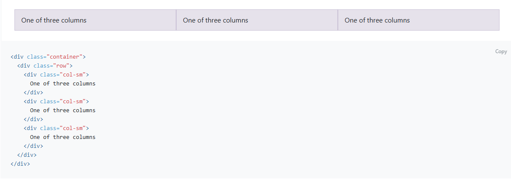

## UI Frameworks
While we can do a ton with HTML and css, a UI framework introduces a new level of efficencty and productivity. UI frameworks give developers pre-designed layouts, reusable com0ponents and responsive design tools. This allows us to not have to build a button from scratch every time we need to implement a button. It also saves a significant amount of time as we dont have to write specific code for a webpage that might be used on a device other than a computer luke tabklests or phones. The responsive aspect of frameworks make it easy to account for users using different devices and even different webbrowsers.

## Bootstrap
Bootstrap is one of the most popular frameworks that is used today. It was origgionally created by twitter then later realesd as an open source prohject on GitHub. It quckily became popular becase of the simplicity it offered with its responsivness. One of its most powerful features is its grid system that automatically adust based on the device a user is using. Bellow is an example of how it works, you can find more information at the [Bootstrap website](https://getbootstrap.com/docs/4.1/getting-started/introduction/).

## My Thoughts
I enjoy learning and using bootstrap, it is always frustrating learning a new thing. But with bootstrap id say its pretty user friendly and not dificult to pick up. Its a really cool tool to learn and very inpresive with how versitle it can be. I also think it makes createing a webpage so much faster than just trying to use HTML and CSS by it self and defenitly way more way less complex. Bellow are two examples of different webpages created with Bootstrap. You can see how different they are and how unique you can make your own webpage.

  
  

