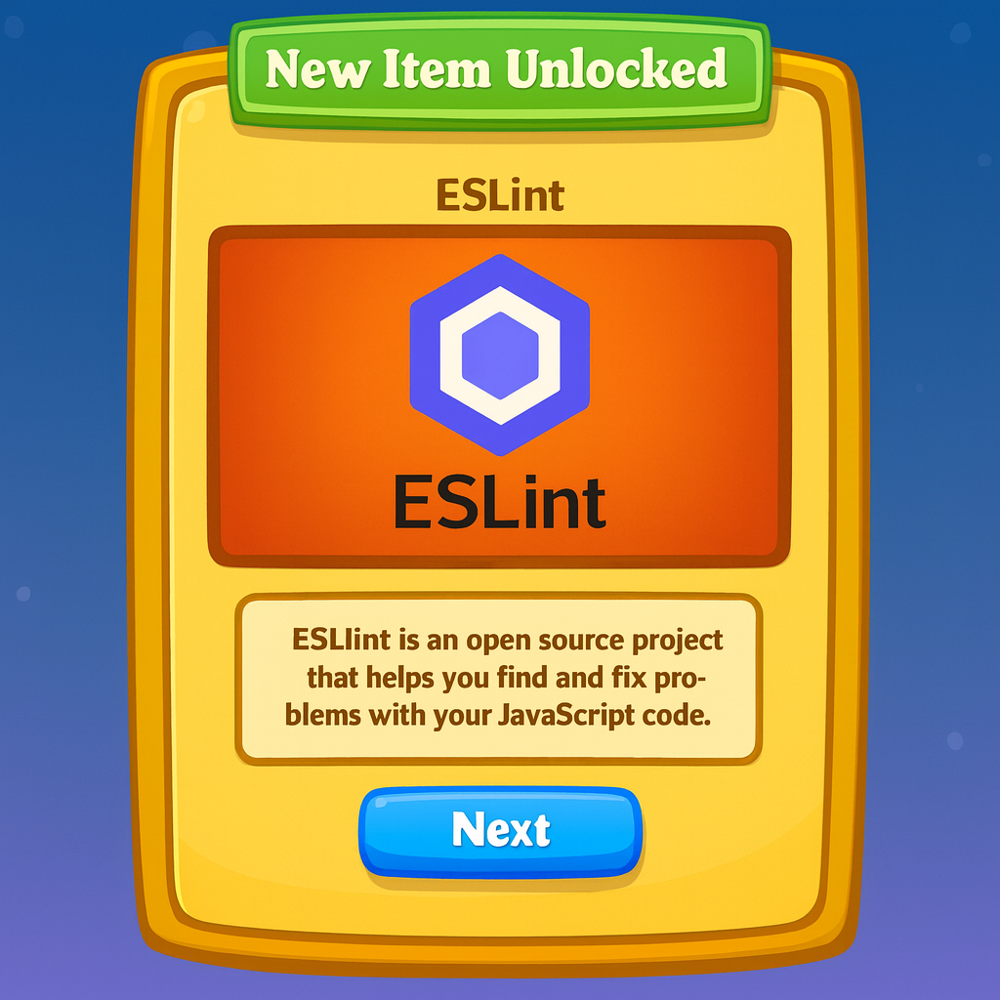

Coding stanndards, love them or hate them they are a must! Coding standards are a set of rules, guidlines and best practices that developers use when writing code. While it can be very annyoying and teidus to abiad by coding standards it is important to do so. These set of rule ensure consiittency, readabilit, and realiablity. All which are crusial to having a well devloped product. Coding standards are very much like grammar and punctuatuion rule in writing, as you can imaging without those two things it would make understanding what some one might write difficult to understand. There are also differnt style guides/rule sets for example for Javascript there is the popular Airbnb Javascript style guide and for python they have PEP 8 style guide. These guides are akin to what guides are followed when writing an essay using MLA or APA styles. 

An extremely helpful tool to keep us in check is ESLint. ESlint is a static code analysis tool, meaning it checks the code before execution. This tool helps us catch errors as we are writing code, it also enforces consistency and promotes best practices. ESLint works by parsing the code into an abstract tree and then appling rules that are custimazable. ESLint reporst the issues with line numbersfor the location of the issue and the explination of the issue, providing insight on how you might fix it. A great feature of ESlint is the "eslint-fix" command, this commad can sometime auto fix many issues saving you time and effort. 

My experience with ESLint so far has been 