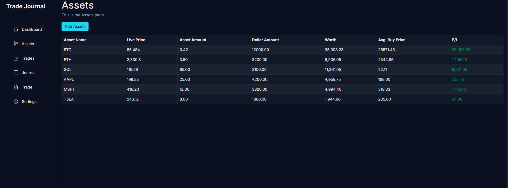

The Investment Tracker started as a spreadsheet replacement for my brokerage notes and turned into a full-stack web dashboard. I wanted one place to record every buy, the number of shares, fees, and the venue so I could see average cost per symbol instantly. I also built in profit-and-loss calculations that pull the latest prices to show true standing..

## Features

- **Guided trade entry.** A modal form validates ticker, quantity, fill price, fees, and account before committing the trade to Supabase.
- **Auto cost-basis math.** The app recomputes weighted average price every time I add shares, even if I buy in multiple accounts.
- **Live P&L cards.** Real-time quote data feeds each position so I can see per-symbol and portfolio-level gains/losses in dollars.
- **Taggable notes.** I tag each trade with a thesis, horizon, and reminders so I remember why I bought a position when I revisit it later.

## Stack

- **Backend:** Supabase/PostgreSQL stores trades, quotes, and tags; CRON edge functions refresh quotes throughout the day.
- **Auth:** Supabase Auth plus optional passkey sign-in so only I can see my holdings.

This cost-basis helper keeps the UI snappy; the recalculation runs locally right after submission so I get instant feedback while Supabase writes the trade asynchronously.
