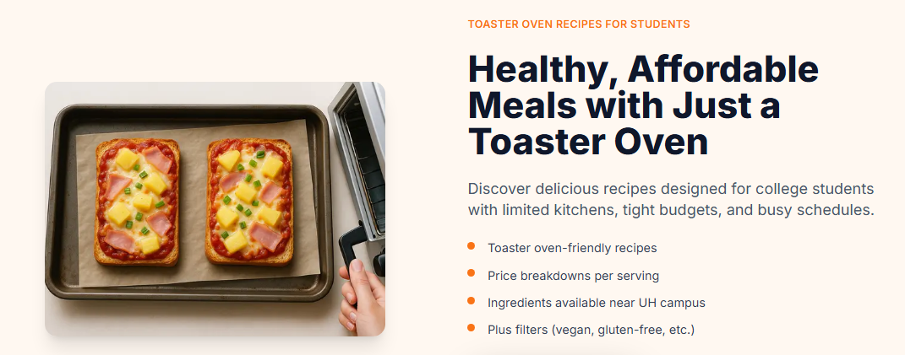

## What we built
- **Landing story + quick metrics.** A warm hero with an image slider introduces the club, while the Quick Stats panel logs visits and shows live counts of recipes, users, and total page views using Prisma. 

- **Recipe browsing with smart search.** Students can filter community recipes by name, ingredient, tags, or dietary needs; cards display tags, average rating, and a favorite heart tied to the viewer's profile. 

- **Rich recipe detail pages.** Each recipe shows owner, tags, ratings, and reviews; signed-in cooks can edit, delete, or favorite entries, and the page suggests where to buy ingredients based on vendor inventories.

- **Community contributions.** Authenticated users submit new dishes with validation, image uploads, tags, and dietary flags; success toasts and redirects keep the flow smooth.

- **Personalized home and profile.** Signed-in members land on a tailored home page with curated tips and top-rated picks, and can manage their profile, dietary badges, contributed recipes, and favorites from a dedicated profile hub.

- **Vendor partnership tools.** Vendors manage storefront details and live ingredient lists, edit prices/availability inline, and add new items that surface automatically on recipe pages.

## Technical foundation
- Built with **Next.js 14** and **React Bootstrap** for fast, responsive pages styled to match the orange-and-cream brand palette. 

- **NextAuth** secures sign-in, sign-up, protected routes, and role-aware actions (admin vs. recipe owner). 

- **Prisma + PostgreSQL** power recipes, favorites, vendors, and telemetry like page visits; all counts and lookups come from the database for real-time accuracy. 

- **UX polish** includes SweetAlert-style toasts, live favorite toggles, and rating widgets to keep contributors engaged while maintaining data integrity through schema validation.

## My contributions
- Drove the design system work: built the shared component library, responsive layouts, and color tokens that keep student, vendor, and admin views visually consistent.
- Implemented the recipe CRUD flow end-to-end, including Prisma models, seed data, and the vendor-to-ingredient linking logic that feeds cost breakdowns.
- Set up CI/CD so every pull request runs lint/tests via GitHub Actions before Vercel deploys, keeping our main branch stable.

## What I learned
- Balancing three role-based experiences requires crisp permission modeling; Prisma’s schema and NextAuth callbacks now enforce that consistently.
- Running usability testing alongside schema design prevented expensive rewrites—student interviews led directly to the search filters and dietary flags.
- Thorough developer docs (env vars, database seeding, deployment steps) dramatically reduced onboarding time for new contributors.

## Impact
Together we shipped a fully authenticated community cookbook tailored to UH students, complete with contribution workflows, vendor sourcing, and engagement telemetry. The experience now greets members with personalized tips, curates top-rated dishes, and keeps vendors in sync so students can cook more and spend less.

---

Learn more at <a href="https://club-oven-lovin.github.io/">club-oven-lovin.github.io</a>.

See website at <a href="https://club-oven-lovin.vercel.app//">club-oven-lovin.vercel.app/</a>.

