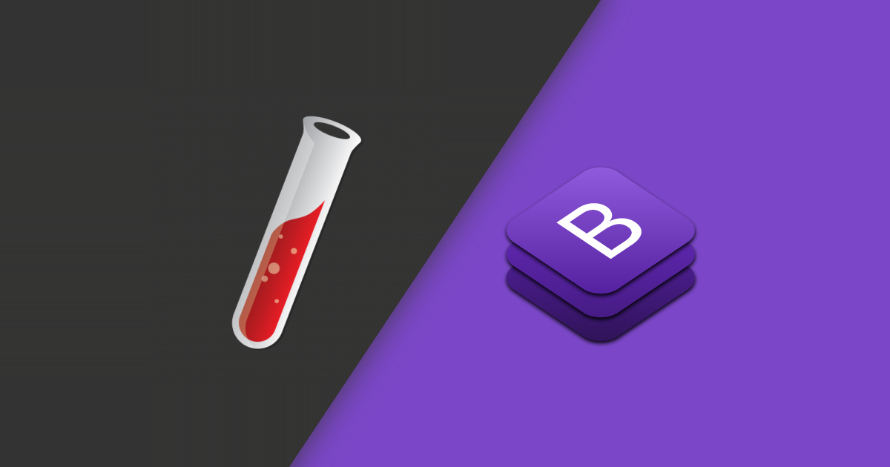

Orbit Time Tracker grew out of my need to understand where my evenings were going. Pomodoro apps felt too rigid, so I built a multi-timer workspace that lets me track context switches without losing history.

## Highlights

- **Unlimited timers.** Create timers for study, workouts, freelancing, or rest and run any combination simultaneously.
- **Timeline view.** A heatmap and stacked bar chart show exactly how long I spent on each category per day.
- **Session notes.** Each timer can capture a short reflection so I remember what I accomplished during that block.
- **Goals + nudges.** Weekly targets trigger reminders when a category is falling behind.
- **Exports.** JSON/CSV exports feed Obsidian and Notion for long-term journaling.

## Under the hood

- **Next.js app router** with server components renders timers even when the client reconnects mid-session.
- **Prisma + SQLite** when offline, with sync to PostgreSQL when I reconnect so I can track time on my phone or laptop seamlessly.
- **Socket.io** broadcasts timer state between devices to avoid double-counting.

```ts
// lib/timers.ts
export function startTimer(timer) {
  return {
    ...timer,
    running: true,
    startedAt: Date.now(),
  };
}

export function stopTimer(timer) {
  const elapsed = Date.now() - timer.startedAt;
  return {
    ...timer,
    running: false,
    totalMs: timer.totalMs + elapsed,
    startedAt: null,
  };
}
```

Simple helpers like these keep the business logic readable while I focus on UX experiments, such as how to display overlapping timers or how to summarize a week without clutter. Orbit is now my go-to ritual check, and it has drastically improved how intentionally I spend my time.
